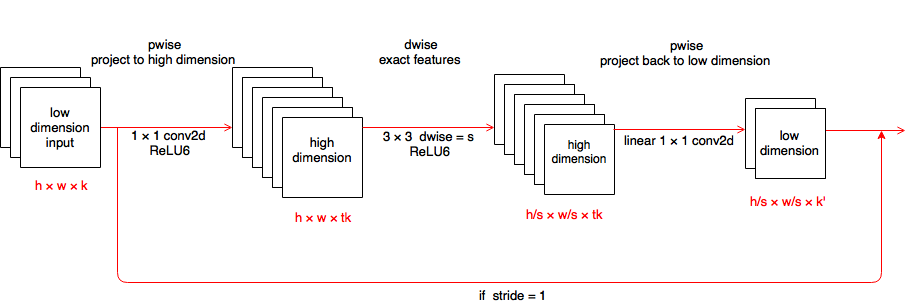

# MobilenetV2.tensorflow
Repository for "[Inverted Residuals and Linear Bottlenecks: Mobile Networks for Classification, Detection and Segmentation](https://arxiv.org/abs/1801.04381)".

## Pre-request libraries
- python2/3
- tensorflow
- [tensorflow-slim](https://github.com/tensorflow/models/tree/master/research/slim) (optional)

## Training & Accuracy
The model was trained with SGD+Momentum optimizer.

|   Optimizer  |   iter   |  Top1 |  Top5 |                    Pre-trained Model                    |
|:------------:|:--------:|:-----:|:-----:|:-------------------------------------------------------:|
| SGD          | 1million | 69.7% | 89.2% | [google drive](https://drive.google.com/open?id=1PBCvhhpoExLg_tYDr_HaGOkeXeFELd_p)|

## Usage
The MobilenetV2 is implemented by two versions:
- [By tensorflow-slim](https://github.com/ShuangXieIrene/MobilenetV2.tensorflow/tree/master/slim-net). 
This version can be copied under [tensorflow-slim](https://github.com/tensorflow/models/tree/master/research/slim/nets) and use the API which is provided by slim to train and test the model. 
- [By tensorflow](https://github.com/ShuangXieIrene/MobilenetV2.tensorflow/tree/master/benchmark-net).
This version is used to achieved higher speed with NCHW and half-percision.

## Network Architecture
Please notice there is a mistake in the paper (after the fourth bottleneck layer, the output size should be  × 64 instead of  × 64 )

| Input                                                       | Operator    | t | c    | n | s |
|-------------------------------------------------------------|-------------|---|------|---|---|
|  × 3  | conv2d      | - | 32   | 1 | 2 |
|  × 32 | bottleneck  | 1 | 16   | 1 | 1 |
|  × 16 | bottleneck  | 6 | 24   | 2 | 2 |
|  × 24  | bottleneck  | 6 | 32   | 3 | 2 |
|  × 32  | bottleneck  | 6 | 64   | 4 | 2 |
|  × 64  | bottleneck  | 6 | 96   | 3 | 1 |
|  × 96  | bottleneck  | 6 | 160  | 3 | 2 |
|  × 160  | bottleneck  | 6 | 320  | 1 | 1 |
|  × 320  | conv2d 1x1  | - | 1280 | 1 | 1 |
|  × 1280 | avgpool 7x7 | - | -    | 1 | - |
| 1 × 1 × k                                                   | conv2d 1x1  | - | k    |   |   |

Each line describes a sequence of 1 or more identical (modulo stride) layers, repeated n times. All layers in the same sequence have the same number c of output channels. The first layer of each sequence has a stride s and all others use stride 1. All spatial convolutions use 3 × 3 kernels. The expansion factor t is always applied to the input size.
### Linear Bottlenecks architecture
The bottleneck blocks use shortcut directly between the bottlenecks to improve the ability of gradient to propagate across multipler layers.
- Because ReLU is capable of preserving information only if the input manifold lies in a low-dimensional subspace of the input space, the input and output data of linear bottlenecks is in low-dimension space. 
- Stride (s) in the depthwise convolutions is for down sampling. 
- Expansion ratio (t) is greater than 1 for projecting the low dimensioal data to high dimension.

 
## TODO
- [x] Pre-trained model 
- [ ] Time test in 1080Ti

